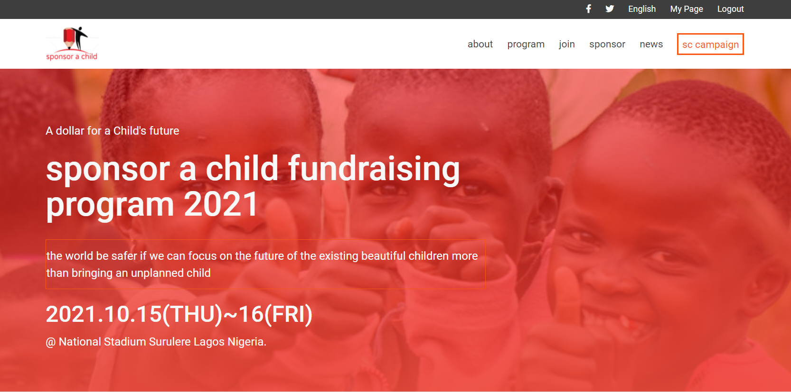
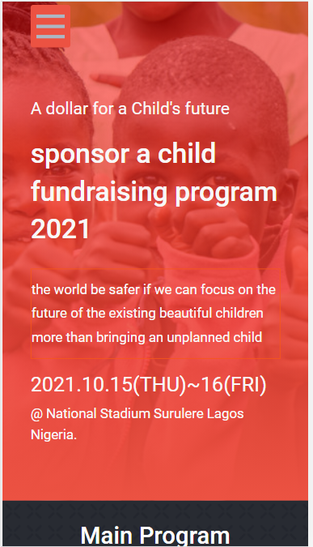
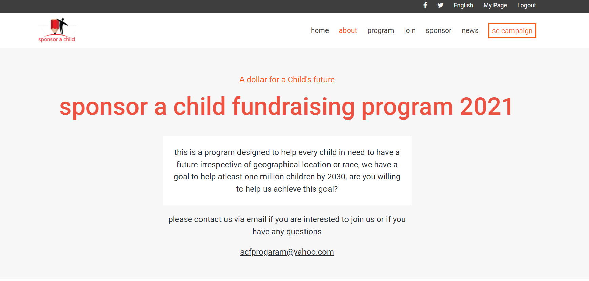
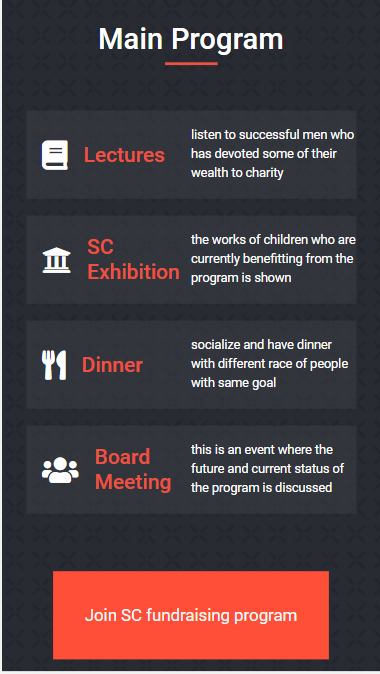

# Sponsor a Child Fundraising Website

## Description
> My first Microverse capstone project which is a fundraising program website for children in need

Desktop view header                        |  Mobile view header
:-----------------------------------------:|:---------------------------------------:
             |  

Desktop view about page                    |  Mobile view main program section
:-----------------------------------------:|:---------------------------------------:
       |  

## Built With

- html
- css
- javascript

## Procedure to clone project
- open your terminal
- type git clone https://github.com/xtrahuman/capstone-module1.git
- type cd capstone-module1 to change directory to the folder of the project
- run the project in your local machine

## project link

[upcoming]()

## Author

👤 **Author**

- GitHub: [@xtrahuman](https://github.com/xtrahuman)
- Twitter: [@xtrahuman](https://twitter.com/xtrahuman)
- LinkedIn: [LinkedIn](https://linkedin.com/in/tochukwu-okpara-449528197)

## 🤝 Contributing

Contributions, issues, and feature requests are welcome!

Feel free to check the [issues page](../../issues/).

## Show your support

Give a ⭐️ if you like this project!

## 📝 License

This project is [MIT](./MIT.md) licensed.

